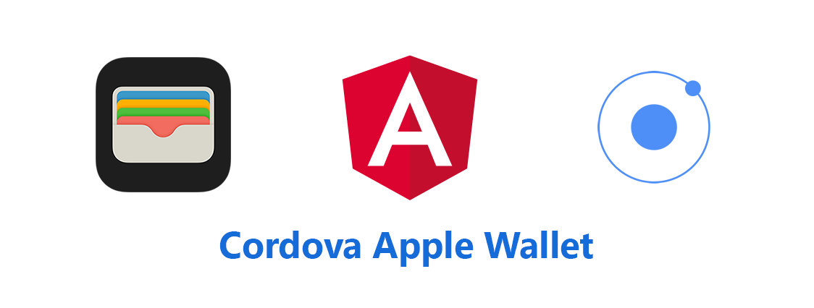

# cordova-apple-wallet

This plugin provides support for adding your credit/debit cards to Apple Wallet. It also can check if the credit/debit card exists in Wallet or any paired device e.g. Apple Watch ⌚

👉 **Important Note**

> Adding payment passes requires a special entitlement issued by Apple. Your app must include this entitlement before you can use this class. For more information on requesting this entitlement, see the Card Issuers section at developer.apple.com/apple-pay/.

## Installation

### Ionic 3 and above

In order to use it with Ionic 3, please follow this [instructions](https://ionicframework.com/docs/native/apple-wallet/)

### Phonegap

  ```shell
  cordova plugin add cordova-apple-wallet --save
  ```

Or the latest (unstable) version:

  ```shell
    cordova plugin add --save https://github.com/tomavic/cordova-apple-wallet
  ```

👉 **NOTE**: _In order to use it with normal cordova based project, please define a global variable, so that you can use it without lint errors_ `var AppleWallet = AppleWallet || {};`

## How to use

### ✔️ Apple Wallet Availability

Simple call to determine if the current device supports Apple Pay and has a supported card installed.

```javascript
    AppleWallet.isAvailable()
    .then((res) => {
    /**
     * Expect res to be boolean
     */
    })
    .catch((err) => {
      // Catch {{err}} here
    });
```

---

### ✔️ Card Eligibility


#### 1 - Check Card Eligibility

Simple call to check Card Eligibility

###### Parameters

__primaryAccountIdentifier__ (String) Your card unique identifier that used in card in-app provisioning

```javascript
    AppleWallet.checkCardEligibility(primaryAccountIdentifier)
    .then((res) => {
    /**
     * Expect res to be boolean
     */
    })
    .catch((err) => {
      // Catch {{err}} here
    });
```


#### 2 - Check Card Eligibility By Suffix
Simple call to checkCardEligibilityBySuffix

##### Parameters: 
__cardSuffix__ (String) The card number suffix ex: last 4 or 6 digits

```javascript
    AppleWallet.checkCardEligibilityBySuffix(cardSuffix)
    .then((res) => {
    /**
     * Expect res to be boolean
     */
    })
    .catch((err) => {
      // Catch {{err}} here
    });
```

---


### ✔️ Paired Devices

#### 1 - Check Paired Devices

Simple call to check out if there is any paired Watches so that you can toggle visibility of 'Add to Watch' button

```javascript
    AppleWallet.checkPairedDevices()
    .then((res) => {
    /**
     * Expect
     * res = {
     *   isWatchPaired: boolean
     * }
     */
    })
    .catch((err) => {
      // Catch {{err}} here
    });
```


#### 2 - Check Paired Devices By Suffix

Simple call to check paired devices with a card by its suffix
##### Parameters

__cardSuffix__ (String) The card number suffix ex: last 4 or 6 digits

```javascript
    AppleWallet.checkPairedDevicesBySuffix(cardSuffix)
    .then((res) => {
    /**
     * object contains boolean values that ensure that card is already exists in wallet or paired-watch
     * Expect
     * res = {
     *    isInWallet: boolean
     *    isInWatch: boolean
     *    FPANID: string
     * }
     * */
    })
    .catch((err) => {
      // Catch {{err}} here
    });
```

---


### ✔️ Card Addition

Simple call with the configuration data needed to instantiate a new PKAddPaymentPassViewController object.

This method provides the data needed to create a request to add your payment pass (credit/debit card). After a successful callback, pass the certificate chain to your issuer server-side using our callback delegate method `AppleWallet.completeAddPaymentPass`. The issuer server-side should returns an encrypted JSON payload containing the encrypted card data, which is required to be get the final response

```javascript
    let data = {
      cardholderName: 'Test User',
      primaryAccountNumberSuffix: '1234',
      localizedDescription: 'Description of payment card',
      paymentNetwork: 'VISA'
    }
    AppleWallet.startAddPaymentPass(data)
    .then((res) => {
    /**
     * User proceed and successfully asked to add card to his wallet
     * Use the callback response JSON payload to complete addition process
     * Expect
     * res = {
     *   "certificateSubCA":"Base64 string represents certificateSubCA",
     *   "certificateLeaf":"Base64 string represents certificateLeaf"
     *   "nonce":"Base64 string represents nonce",
     *   "nonceSignature":"Base64 string represents nonceSignature",
     * }
     */
    })
    .catch((err) => {
      // Error or user cancelled.
    });
```

👉 **NOTE**: _The encryption scheme, cardholder name, and primary account suffix are required for configuration. The configuration information is used for setup and display only. It should not contain any sensitive information._

In order to get testing data check this [Apple Sandbox](https://developer.apple.com/apple-pay/sandbox-testing)

---

### ✔️ Card Addition Callback Delegate

Simple completion handler that takes encrypted card data returned from your server side, in order to get the final response from Apple to know if the card is added succesfully or not.

- `activationData`: The request’s activation data.
- `encryptedPassData` : An encrypted JSON file containing the sensitive information needed to add a card to Apple Pay.
- `ephemeralPublicKey` The ephemeral public key used by elliptic curve cryptography (ECC). or `wrappedKey` if you are using RSA

```javascript
    let encryptedData = {
        activationData: "encoded Base64 activationData from your server",
        encryptedPassData: "encoded Base64 encryptedPassData from your server",
        wrappedKey: "encoded Base64 wrappedKey from your server"
    }
    AppleWallet.completeAddPaymentPass(encryptedData)
    .then((res) => {
      /**
       * A success callback response means card has been added successfully,
       * PKAddPaymentPassViewController will be dismissed
       * Expect
       * res to be String value 'success' or 'error'
       */
    })
    .catch((err) => {
      // Error and can not add the card, or something wrong happend
      // PKAddPaymentPassViewController will be dismissed
    });
```

## Support

For more information, please check Apple Developer documentation from [here](https://developer.apple.com/documentation/passkit/pkaddpaymentpassviewcontrollerdelegate/1615915-addpaymentpassviewcontroller?language=objc)

## Contributing

1. Fork it
2. Create your feature branch (`git checkout -b my-new-feature`)
3. Commit your changes (`git commit -am 'Add some feature'`)
4. Push to the branch (`git push origin my-new-feature`)
5. Create new Pull Request


## License

MIT


## Donate 


If you think that any information you obtained here is worth of some money and are willing to pay for it, you can give me a cup of coffee ☕ 😉


[](https://www.paypal.com/cgi-bin/webscr?cmd=_donations&business=hbasheer%40live.com&item_name=Business&currency_code=USD&source=url)

## Credits

Made with ❤️ by Hatem. Follow me on [Twitter](https://twitter.com/toomavic) to get the latest news first! I will be happy to receive your feedback via [Email](hbasheer@live.com) ! I am always happy to hear your feedback.
Enjoy!


    ░░░░░░░░░░░░░▄▄▄▄▄▄▄▄▄▄▄▄▄▄▄▄▄▄▄▄▄▄▄▄▄▄▄▄▄▄▄▄ 
    ░░░░░░░░░░█░░░░░░▀█▄▀▄▀██████░░░▀█▄▀▄▀██████ 
    ░░░░░░░░ ░░░░░░░░░░▀█▄█▄███▀░░░░░░▀█▄█▄███▀░

   All copyrights reserved | Enigma Labs © | 2019
